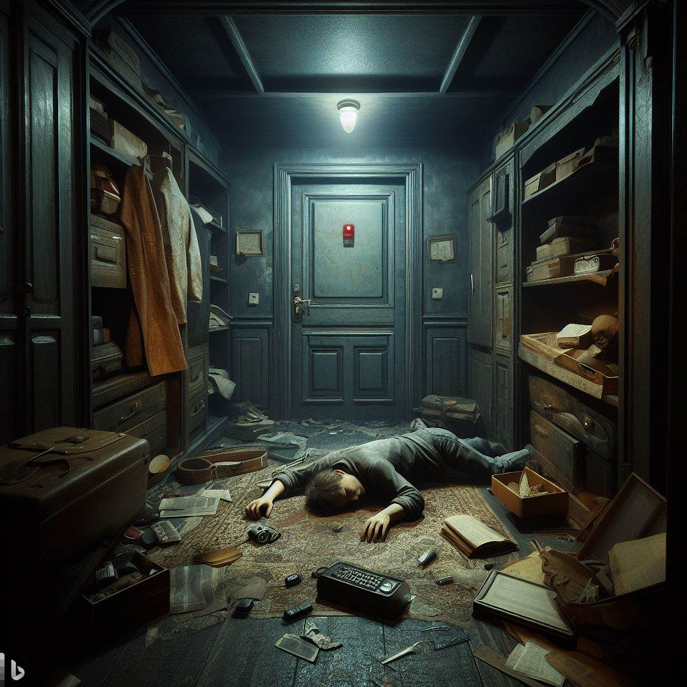

# Room Escape - A Cairo Game

You open your eyes and gasp. You are lying on a cold, hard floor in a dimly lit room. You have no idea where you are or how you got here. You look around and see a clutter of old furniture, books, and papers. The air is stale and dusty. The only exit is a metal door with a keypad and a red light. You get up and rush to the door, hoping to escape. You pull the handle, but it doesn't budge. It's locked. You hear a faint beep and notice a digital counter on the wall. It shows 60:00 and starts to count down. You feel a surge of panic. You need to find the code to unlock the door before the time runs out. But where is it hidden? You scan the room, looking for clues. You see a note on a table, a painting on the wall, a bookshelf, and a chest. You don't have much time. You need to act fast. What will you do?

<p align="center">
  
</p>

## Setup

### Dojo instalation

Check out the instalation steps [here](https://book.dojoengine.org/).

### Bevy instalation

Check out the instalation steps [here](https://bevyengine.org/learn/book/getting-started/setup/).

### Deploying the world

First, get Katana started by running the following command:

```bash
katana --disable-fee
```

Build the contract:

```bash
sozo build
```

Deploy the contract:

```bash
sozo migrate --name room_escape
```

Once deployed, get the `WORLD_ADDRESS` and `ACTION` contracts and copy them into the `src/configs.rs`

```rust
// world
pub const WORLD_ADDRESS: &str = "YOUR_WORLD_CONTRACT_HERE";
pub const ACTIONS_ADDRESS: &str ="YOUR_ACTION_CONTRACT_HERE";
```

### Starting the game

Now that we have everything setup,

```bash
cargo run
```

## Game commands

Keyboard commands:

- `A` - move left
- `B` - move right
- `E` - interact with the object
- `Enter` - reset the pre-recorded keystrokes
